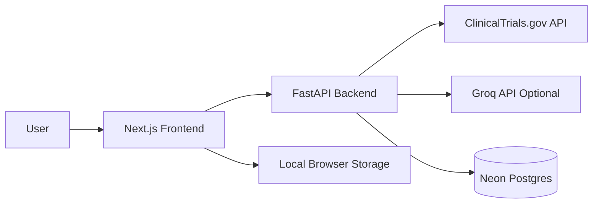
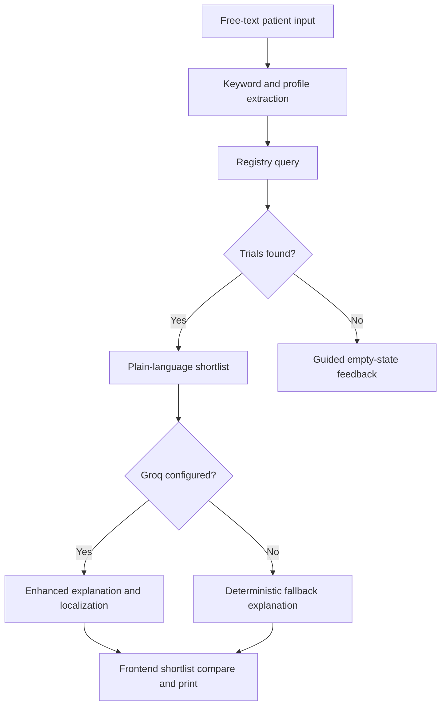

# TrialBridge

TrialBridge is a clinical trial discovery MVP that turns plain-language patient descriptions into a clinician-discussable shortlist of trial opportunities.

It is designed for people who do not know registry terminology, may be searching in everyday language, and need a calmer starting point before talking with a doctor or study team.

## Table of Contents

- [Why TrialBridge Exists](#why-trialbridge-exists)
- [What It Does Today](#what-it-does-today)
- [Current Scope](#current-scope)
- [Product Principles](#product-principles)
- [Tech Stack & Architecture](#tech-stack--architecture)
- [Repository Structure](#repository-structure)
- [Request Flow](#request-flow)
- [API Overview](#api-overview)
- [Local Development](#local-development)
- [Deployment](#deployment)
- [Build Commands](#build-commands)
- [Privacy and Safety](#privacy-and-safety)
- [Known Limitations](#known-limitations)
- [Roadmap](#roadmap)
- [Hackathon Context](#hackathon-context)
- [Contributing](#contributing)
- [License](#license)

## Why TrialBridge Exists

Clinical trial registries are powerful, but they are not built for most patients. People usually start with symptoms, diagnosis fragments, or treatment history in natural language. TrialBridge narrows that gap by:

- accepting plain-language patient input
- querying live registry data
- translating results into plain-language summaries
- preserving a conservative safety posture around eligibility and medical advice

## What It Does Today

- Searches live trial data from ClinicalTrials.gov
- Accepts free-text patient descriptions
- Detects the input language with lightweight heuristics
- Builds a simple patient profile and keyword set
- Returns plain-language trial summaries
- Works without AI access for core discovery
- Uses Groq optionally for better explanation/localization quality
- Lets users save trials locally, compare them, and print a doctor-facing brief
- Ships a cinematic Next.js frontend with PWA support

## Current Scope

TrialBridge is intentionally honest about what is implemented versus what is planned.

- Live registry search is currently implemented for ClinicalTrials.gov
- EU CTR and ISRCTN are included in the API transparency response, but are not yet fully integrated as live search sources
- Notification subscription plumbing exists in the backend, but a complete end-user notification workflow is still future work
- Matching is heuristic and exploratory, not a clinical eligibility engine

## Product Principles

- Discovery, not diagnosis
- Potential match, not eligibility confirmation
- Minimal retention
- Plain language over registry jargon
- Useful even when AI is unavailable

## Tech Stack & Architecture

| Layer | Technology | Purpose / Role |
| :--- | :--- | :--- |
| **Frontend Framework** | Next.js 14 (React 18) | Core framework utilizing App Router for fast, structured rendering. |
| **Styling & Theme** | Vanilla CSS | Zero-dependency styling for precise control over the cinematic UI. |
| **Motion Design** | GSAP | Rich micro-animations and smooth transition choreography. |
| **3D Rendering** | Three.js / React Three Fiber | Renders the interactive, animated globe on the landing experience. |
| **Offline Support** | `next-pwa` | Enables PWA capabilities, including local service worker caching. |
| **Backend API** | FastAPI | High-performance Python ASGI web framework for fast API request handling. |
| **Web Server** | Uvicorn | Production-ready ASGI server implementation. |
| **Registry Integration** | `httpx` | Asynchronous client for querying live registry data from ClinicalTrials.gov. |
| **Database Client** | `psycopg` | Connects the backend securely to the Serverless Postgres instance. |
| **AI Inference** | Groq SDK (Llama 3.1) | Optional service to enhance and localize plain-language trial explanations. |
| **Data Persistence** | Neon Postgres | Serverless cloud PostgreSQL database for keeping subscription state. |
| **Backend Hosting** | Render | Managed hosting platform using Docker containers for standard deployment. |
| **Frontend Hosting** | Vercel | Global CDN deployment for static assets and Next.js edge-rendering. |



## Repository Structure

```text
.
|-- backend/                     FastAPI API code, Dockerfile, Python dependencies
|-- frontend/                    Next.js application files
|   |-- app/                     Active App Router pages & assets
|   |-- components/              Reusable React UI components
|   |-- public/                  Static resources & PWA manifests
|-- docs/                        Local technical docs (ignored from git)
|-- meta_docs/                   Local project planning docs (ignored from git)
|-- main_docs_for_hackathon/     Local presentations & notes (ignored from git)
|-- render.yaml                  Render service blueprint config
```

## Request Flow

1. A user enters a free-text case description.
2. The backend extracts lightweight keywords and a minimal patient profile.
3. TrialBridge queries registries in parallel.
4. Raw registry results are converted into plain-language trial summaries.
5. If Groq is configured, explanations are improved with localized, structured output.
6. The frontend renders a shortlist, or a clear empty-state if no trials are found.



## API Overview

### `POST /api/search`

Accepts:

```json
{
  "patient_description": "metastatic breast cancer HER2 negative prior chemotherapy near Boston",
  "override_language": "en"
}
```

Returns:

- `detected_language`
- `profile`
- `registries_queried`
- `registries_responded`
- `explained_trials`
- `correlation_id`

### `POST /api/notify/subscribe`

Stores a minimal notification subscription record:

- condition keywords
- detected language
- Web Push endpoint
- Web Push keys

### `GET /health`

Liveness probe.

### `GET /ready`

Readiness probe that confirms database connectivity.

## Local Development

### Prerequisites

- Python 3.12+
- Node.js 18+
- npm
- A Neon/Postgres connection string

### 1. Start the backend

```bash
cd backend
python -m venv .venv
.venv\Scripts\activate
pip install -r requirements.txt
uvicorn main:app --reload --host 0.0.0.0 --port 8000
```

Create `backend/.env` with:

```env
DATABASE_URL=postgresql://...
GROQ_API_KEY=gsk_...
GROQ_MODEL=llama-3.1-8b-instant
AI_RATE_LIMIT=20
AI_RATE_WINDOW_SECONDS=3600
```

Notes:

- `DATABASE_URL` is required at startup
- `GROQ_API_KEY` is optional
- without Groq, search still works and falls back to deterministic explanations

### 2. Start the frontend

```bash
cd frontend
npm ci
npm run dev
```

Create `frontend/.env.local` with:

```env
NEXT_PUBLIC_API_URL=http://localhost:8000
```

If `NEXT_PUBLIC_API_URL` is not set, the frontend falls back to `http://localhost:8000`.

## Deployment

### Backend on Render

This repository already includes [`render.yaml`](./render.yaml), which defines:

- Docker runtime
- `backend/` as the service root
- `/health` as the health check
- env vars for database, Groq, and AI rate limiting

Required Render environment variables:

- `DATABASE_URL`
- `GROQ_API_KEY`

Optional:

- `GROQ_MODEL`
- `AI_RATE_LIMIT`
- `AI_RATE_WINDOW_SECONDS`

### Frontend on Vercel

The frontend includes [`frontend/vercel.json`](./frontend/vercel.json) with:

- `framework: nextjs`
- `installCommand: npm ci`
- `buildCommand: npm run build`

Required Vercel environment variable:

- `NEXT_PUBLIC_API_URL`

Set it to the public Render backend URL.

## Build Commands

Frontend:

```bash
cd frontend
npm run build
```

Backend syntax check:

```bash
cd backend
.venv\Scripts\python.exe -m py_compile main.py
```

## Privacy and Safety

TrialBridge is a health-adjacent product and should be treated conservatively.

- It is an informational discovery tool, not a medical device
- It does not determine trial eligibility
- It does not replace a physician or study coordinator
- It should avoid logging raw patient text
- Subscription persistence is intentionally minimal
- Every surfaced trial should be verified with the study team

## Known Limitations

- ClinicalTrials.gov is the only fully live registry integration in the current code
- Some symptom-only searches may still return no shortlist
- Language handling is intentionally lightweight today
- CORS is currently wide open for MVP convenience
- PWA support is enabled, but install polish is still incomplete
- Test coverage is still minimal and mostly smoke-level

## Roadmap

Near-term improvements that would meaningfully strengthen the project:

- complete live integrations for EU CTR and ISRCTN
- improve condition extraction and ranking heuristics
- add structured tests around `/api/search`
- build the full notification delivery loop
- add clinician-friendly export improvements
- tighten privacy, auth, and observability for production

## Hackathon Context

TrialBridge was built as an OpenAI Build Week project and evolved significantly over time:

- foundation and production scaffolding
- AI safeguards and graceful no-AI fallback
- offline-aware/productivity features
- Vercel + Render deployment readiness
- a major cinematic frontend redesign
- clearer empty-state and search feedback handling

The commit history tells that story well and is worth reading if you want the full product arc.

## Contributing

Contributions are easiest when they preserve three things:

- conservative medical language
- privacy minimization
- honesty about what is implemented versus what is aspirational

High-value contribution areas:

- registry integrations
- search quality
- testing
- privacy hardening
- clinician handoff UX

## License

A repository license file is not currently included. Add one before public open-source distribution.
