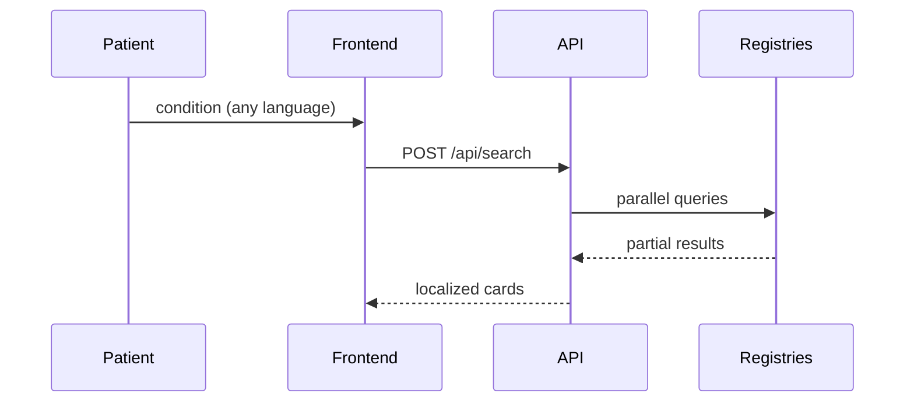

# UML diagrams

```mermaid
sequenceDiagram
 Patient->>Frontend: condition (any language)
 Frontend->>API: POST /api/search
 API->>Registries: parallel queries
 Registries-->>API: partial results
 API-->>Frontend: localized cards
```

