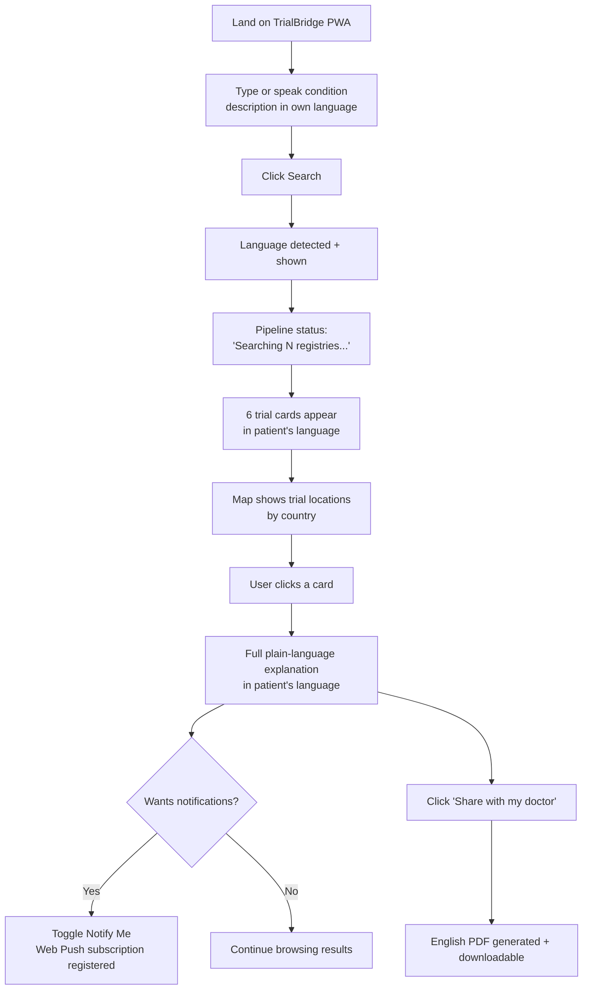
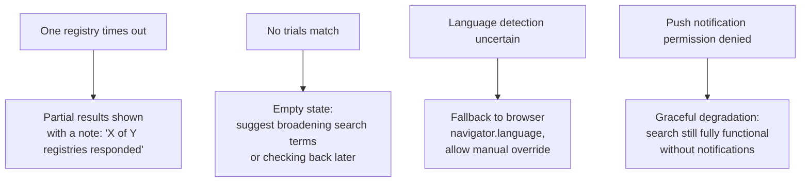

# TrialBridge — app_flow.md

## 1. Primary User Journey

## 2. Screen Flow

| Screen | Purpose | Key Components |
|---|---|---|
| Landing / Search | Capture condition description | SearchInput, LanguageDetector |
| Results | Show ranked, explained trial matches | TrialCard, TrialMap, EligibilityBadge |
| Trial Detail (expanded card) | Full explanation in patient's language | TrialCard (expanded state) |
| Notification Settings | Opt into future match alerts | NotifyToggle |
| Doctor Report | Physician-facing English PDF | DoctorReport |

## 3. Error / Edge-Case Flows

## 4. User Journey Documentation Requirements (Mandatory for Stage 2)

- `docs/system_overview.md` must narrate the primary journey (Section 1)
  in plain English, explicitly calling out that the ENTIRE journey
  (search, results, explanation) happens in the patient's own language,
  not just the initial input.
- `docs/codebase_explained.md` must map every screen/component in Section
  2's table to its exact frontend file path.
- `docs/troubleshooting_guide.md` must document all edge-case flows in
  Section 3, including exact log signatures to look for when diagnosing a
  registry timeout vs. a genuine zero-results case.

## 5. Screen Flow Documentation Requirements
- Every component in Section 2 documented in `docs/lld.md` with props,
  state, and API calls.
- `.private_docs/code_walkthrough.md` must specifically walk through how
  the language-detection result flows through every downstream component
  (Results screen, TrialCard, DoctorReport) since maintaining language
  consistency across the whole UI is the trickiest cross-cutting concern
  in this codebase.
