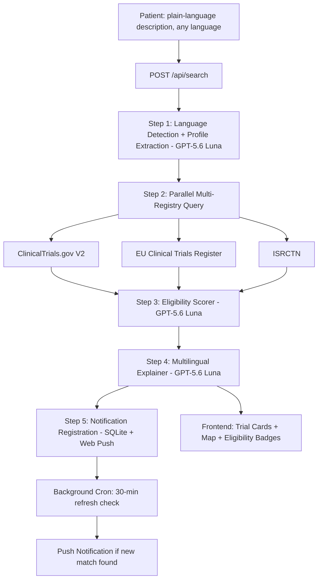
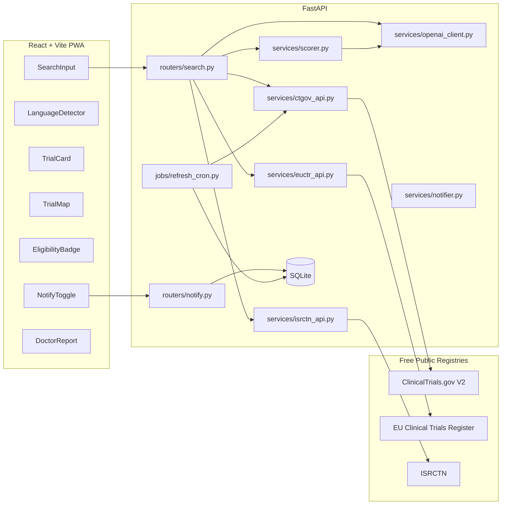
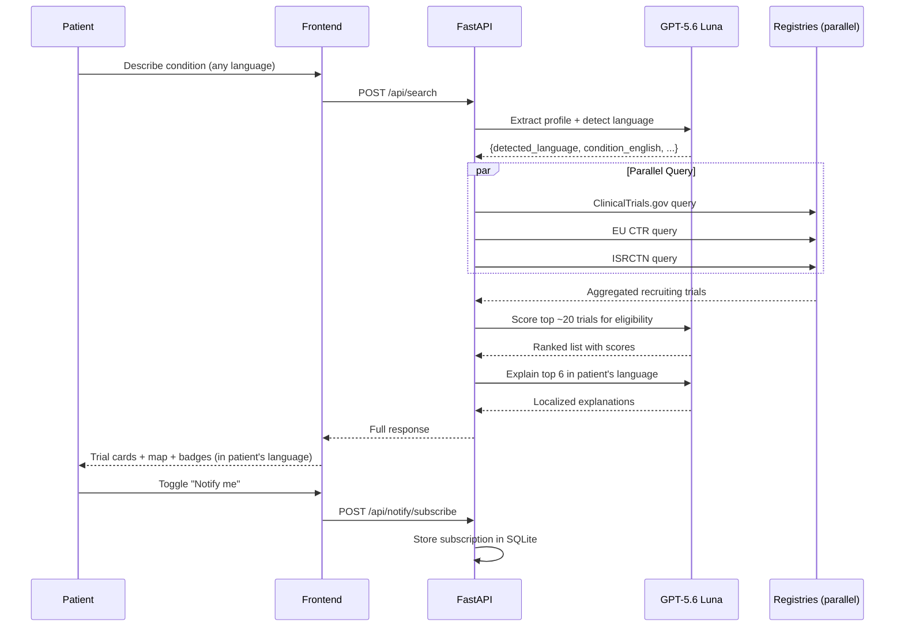
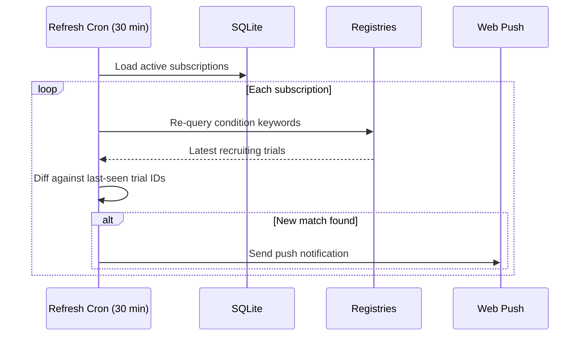

# TrialBridge — architecture.md

## 1. System Architecture Overview

## 2. Component Diagram

## 3. Sequence Diagram — Full Search Pipeline

## 4. Background Notification Flow

## 5. Documentation Structure Requirements (Mandatory for Stage 2)

- `docs/hld.md` — expand the diagrams above with deployment topology and
  the rationale for SQLite-only persistence (notification matching, not
  clinical records).
- `docs/lld.md` — exact request/response schemas, cron job internals.
- `docs/uml_diagrams.md` — component + deployment diagrams beyond above.
- `docs/class_diagrams.md` — Pydantic models in Mermaid `classDiagram`.
- `docs/entity_relationships.md` — the SQLite subscription schema (see
  `backend_schema.md`).
- `docs/system_overview.md` — plain-English walkthrough for a new
  engineer, with explicit emphasis on the multilingual pipeline since
  it's the core differentiator.
- `docs/design_decisions.md` — why 3 separate LLM calls (extraction,
  scoring, explanation) instead of one mega-prompt (answer: each step
  needs different output shape and failure isolation; a scoring failure
  shouldn't require re-running language detection).

## 6. HLD Requirements
Deployment topology, external registry dependency map (with explicit
freshness characteristics per registry), and the boundary between
deterministic registry-query code and LLM reasoning stages.

## 7. LLD Requirements
Every Pydantic model field, every service function signature, the exact
JSON schema for each GPT-5.6 Luna call, and the cron job's diffing logic
for detecting "new" matches.

## 8. UML Requirements
Minimum: component diagram, sequence diagram (search + notification flows
above), class diagram, deployment diagram.

## 9. Architecture Documentation Requirements
- Every architectural decision (SQLite vs. Postgres, parallel vs.
  sequential registry queries, 3-call pipeline vs. 1 mega-prompt) must
  be in `.private_docs/architecture_rationale.md`.
- `docs/known_tradeoffs.md` must list every hackathon-scope tradeoff
  (2-3 registries instead of full WHO ICTRP 18, no long-term medical
  history storage, etc.) with a note on the production path.
