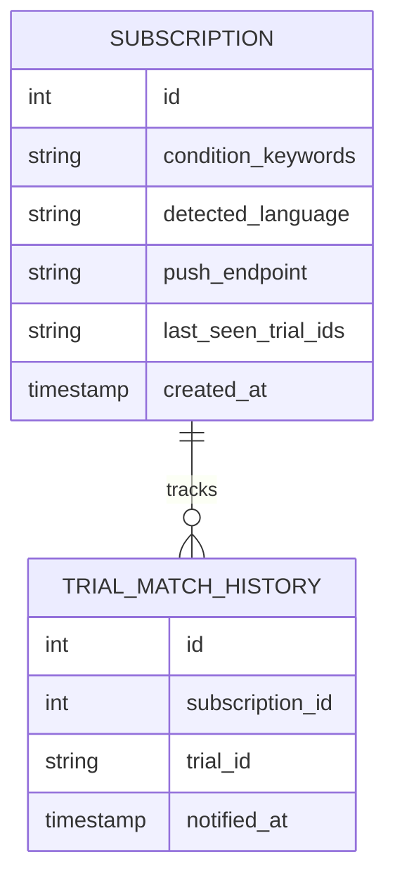

# TrialBridge — backend_schema.md

## 1. Runtime Request/Response Models (Pydantic, no persistence)

```python
class SearchRequest(BaseModel):
    patient_description: str
    override_language: str | None = None  # ISO 639-1, optional

class PatientProfile(BaseModel):
    detected_language: str
    condition_english: str
    condition_keywords: list[str]
    current_treatments: list[str]
    treatment_history: list[str]
    patient_location: str | None = None
    age_mentioned: str | None = None
    specific_requirements: list[str]

class TrialRaw(BaseModel):
    nct_id: str
    source_registry: str  # "ClinicalTrials.gov" | "EU CTR" | "ISRCTN"
    title: str
    summary: str
    eligibility_criteria: str
    location_city: str | None
    location_country: str | None
    phase: str | None
    status: str

class ScoredTrial(BaseModel):
    trial: TrialRaw
    eligibility_score: int  # 0-100
    key_match_reasons: list[str]
    potential_barriers: list[str]
    distance_from_patient: str | None = None

class ExplainedTrial(BaseModel):
    trial_id: str
    title: str          # in patient's language
    explanation: str    # in patient's language
    eligibility_plain: str
    location_plain: str
    next_step: str

class SearchResponse(BaseModel):
    detected_language: str
    profile: PatientProfile
    registries_queried: list[str]
    registries_responded: list[str]  # for partial-failure transparency
    explained_trials: list[ExplainedTrial]
```

## 2. SQLite Schema (Notification Subscriptions Only)

```sql
CREATE TABLE subscriptions (
    id INTEGER PRIMARY KEY AUTOINCREMENT,
    condition_keywords TEXT NOT NULL,     -- JSON array, stored as text
    detected_language TEXT NOT NULL,
    push_endpoint TEXT NOT NULL,
    push_keys TEXT NOT NULL,              -- JSON, Web Push auth keys
    last_seen_trial_ids TEXT,             -- JSON array, for diffing on refresh
    created_at TIMESTAMP DEFAULT CURRENT_TIMESTAMP
);
```

This is the **entire** persistence layer for the MVP. No patient
identity, no full medical history, no raw free-text patient description
is stored — only the minimal condition keywords needed to re-match on
each cron cycle, deliberately minimizing sensitive data retention.

## 3. Conceptual Entity Relationships


`TRIAL_MATCH_HISTORY` is a deferred future table (currently the diffing
uses `last_seen_trial_ids` inline on `SUBSCRIPTION`) — documented here so
the schema rationale doc has a clear expansion target.

## 4. Schema Documentation Requirements (Mandatory for Stage 2)
- `docs/database_design.md` must explicitly justify SQLite over Postgres
  for the hackathon MVP (single-instance simplicity, minimal data volume,
  zero external dependency) and describe the Postgres migration path
  (straightforward schema-preserving migration given the simple table
  shape above).
- `.private_docs/database_rationale.md` must explicitly address why NO
  raw patient description or full medical history is persisted — this is
  a deliberate privacy-minimization decision, not an oversight, and must
  be defensible in an interview/audit context.

## 5. Entity Relationship Documentation Requirements
- `docs/entity_relationships.md` must expand the ERD above and explain
  the `last_seen_trial_ids` diffing mechanism in plain English, since
  it's the core logic behind the notification feature.

## 6. Database Explanation Requirements
- `docs/database_design.md` must address every item in the production-
  readiness database checklist (indexes, migrations, backups, etc.) even
  though the schema is intentionally minimal — e.g., "no composite index
  needed at this table size; would index `condition_keywords` if this
  table grows beyond ~10k rows."
